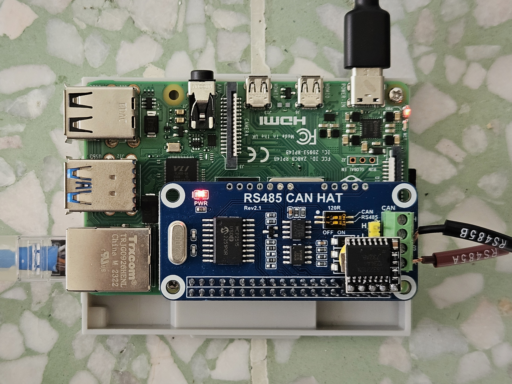

# Setting Up Raspberry Pi for Energy Data Logger (Offline + Modbus RTU)



*Setup and dashboard UI may subject to change in future updates*

## Flashing OS to the Raspberry Pi
> **Note:** Skip to [Appendices](#appendices) for flash-ready image files.

1. Insert the MicroSD card into your laptop and launch the [Raspberry Pi Imager](https://www.raspberrypi.com/software/).

2. Select Raspberry Pi 4 for the model and Raspberry Pi OS Lite, which can be found by going to Choose OS -> Raspberry Pi OS (Other) -> Raspberry Pi OS Lite (64-bit) and select the microSD card's model for Storage.

   

3. Select Next -> Edit Settings and configure the settings as shown below.
   > **Note:** Enter your desired hostname, then create your root username and password. Wi-Fi is your personal hotspot's SSID and password.

   

4. Enable SSH with password authentication.

   

5. Apply the changes and allow the program to write to the SD card. Once complete, insert the SD card into its designated slot under the Pi and boot it up with the micro-USB adapter. Give it a few minutes to setup.

*This documentation part is referenced from **[xyberii4](https://github.com/xyberii4)**.*

## SSH into Raspberry Pi

### Finding the Pi’s IP Address (Windows)

1. Boot Raspberry Pi up, wait 30-60s for WiFi to activate and connect to the Pi’s configured WLAN.

2. Make sure the local machine is on the same WLAN as the Pi. Open a terminal and run the following command:
   >**Note:** Replace `<NETWORK_ID>` with the first three octets of your IPv4 address.

   ```bash
   ipconfig
   nmap -sn <NETWORK_ID>.1/24
   ```

4. Look for “Raspberry Pi” in the results and note its IP address.

### Establishing SSH Connection

1. **Option 1**: Use [PuTTY](https://www.putty.org) (GUI)

2. **Option 2**: Any UNIX Shell (e.g. WSL)

3. Run the following command in the terminal:

   ```bash
   ssh <username>@<ip-address>
   ```

---

## Post‐flash Configurations

### Install Necessary Resources

1. Update the OS and install necessary packages on the Pi:

   ```bash
   sudo apt-get update
   sudo apt-get upgrade
   sudo apt install python3 python3-pip python3-venv -y
   sudo apt install sqlite3 -y
   ```

2. Install Git on the Pi:

   ```bash
   sudo apt-get install git
   ```

3. Make the following configuration changes in `raspi-config`:

   ```bash
   sudo raspi-config
   ```

   * Using your arrow keys, choose **System Options → Boot/Auto Login → Console/AutoLogin**.
   * Choose **Interface Options → I2C → Yes**.
   * Choose **Interface Options → Serial Port → No → Yes**.
   * Choose **Interface Options → RPi Connect → Yes**. Follow any on‐screen instructions.
   * Choose **Finish → Yes** to reboot.
   * Once rebooted, reconnect to the Pi and update the system again:

   ```bash
   sudo apt-get update
   sudo apt-get upgrade
   ```

### Cloning Repository and Setting Up the Logger Environment

1. With Git installed, clone the project and navigate into it:

   ```bash
   git clone https://github.com/AlaskanTuna/energy-data-logger.git
   cd energy-data-logger/
   ```

2. Create and activate a virtual environment:

   ```bash
   python3 -m venv venv
   source venv/bin/activate
   ```

3. Install the required Python packages:

   ```bash
   pip install -r requirements.txt
   ```

4. Create a `.env` file with the following format:

   ```bash
   # INFLUXDB

   INFLUXDB_URL = "http://localhost:8086"
   INFLUXDB_TOKEN = ""

   # GRAFANA

   GRAFANA_URL = "http://localhost:3000"

   # GCP

   GCP_SERVER_URL = "http://GCP_SERVER_URL:8000"
   ```

5. Create a [table](https://files.catbox.moe/z2yuxa.txt) in the remote database (optional, for online data sync):
   > **Note:** Ensure that the remote database credentials have been filled in correctly in the `.env` file and `REMOTE_DB_ENABLED` is set to `True` in `src/config/config.py`.

5. To run the energy logger webapp manually, navigate to `src/` and run `webapp.py`: 

   ```bash
   cd src/
   python webapp.py
   ```
   > **Note:** To use generated mock data, set `USE_MODBUS = False` and `DEVELOPER_MODE = True` in `src/config/config.py`. Conversely, for actual MODBUS readings (when wired with RS-485), set `USE_MODBUS = True` and `DEVELOPER_MODE = False`.

6. To have the webapp always running and accessible anytime, please refer to [Setting Up systemd for Gunicorn WSGI (For Webapp)](#setting-up-systemd-for-gunicorn-wsgi-for-webapp).

### Retrieving Data from the Pi

1. Connect to the Pi via SSH.

2. Navigate to the repository folder:

   ```bash
   cd energy-data-logger/
   ```

3. If you haven’t already created a local directory for plots and CSV files, do so:

   ```bash
   mkdir -p data
   ```

4. Download the generated files from the Pi. For example:

   ```bash
   scp admin@<Pi_IP>:~/energy-data-logger/data/energy_data.csv ./data/
   scp admin@<Pi_IP>:~/energy-data-logger/data/*.png ./data/
   ```

---

## Real Time Clock (RTC)

1. Have the RTC module (DS-3231) wired/connected accordingly to the Pi.
   > **Note:** Make sure to have I2C interface enabled in `raspi-config` already.

2. Install the I2C helper tools:

   ```bash
   sudo apt-get update
   sudo apt-get install -y i2c-tools
   ```

3. Detect the device to confirm the wiring. The output should show `68`/`UU` at address 68:

   ```bash
   sudo i2cdetect -y 1
   ```

4. Enable RTC driver by editing the boot config file:

   ```bash
   sudo nano /boot/firmware/config.txt
   
   # Followed by adding this line under the `[all]` section:
   dtoverlay=i2c-rtc,ds3231
   ```

5. Save the config file and reboot the Pi:

   ```bash
   sudo reboot
   ```

6. After rebooting, the RTC is active and needs to be set to the correct time once. Ensure that **Internet connection** is available on the Pi to synchronize system time.

7. Write the Pi's correct system time to the RTC module for storage:

   ```bash
   sudo hwclock -w
   ```

8. Verify the time was saved by reading it back from the RTC module:

   ```bash
   sudo hwclock -r
   ```

## LAN Connection between Pi and Controller Device

### Setting Up systemd for dnsmasq (For Ethernet)
>**Note:** For RPi Debian Bookworm OS, the default network stack is NetworkManager, which network profiles are stored under `/etc/NetworkManager/system-connections/` and ignores `dhcpcd.conf`.

1. Create a connection profile for the `eth0` network interface:

   ```bash
   sudo nmcli connection add \
      type ethernet \
      ifname eth0 \
      con-name eth0 \
      autoconnect yes \
      ipv4.method manual \
      ipv4.addresses <static_ip_address>/24 \
      ipv4.gateway "" \
      ipv4.dns ""
   ```

2. Bring up the connection profile:

   ```bash
   sudo ip link set eth0 up
   sudo nmcli connection up eth0
   ```

3. Install DHCP service on the Pi:

   ```bash
   sudo apt-get update
   sudo apt-get install dnsmasq
   ```

4. Create the DHCP config and fill its content:

   ```bash
   # Create the DHCP (dnsmasq) config file
   sudo nano /etc/dnsmasq.d/eth0-dhcp.conf
   ```

5. Paste the following content into the nano editor
   ```bash
   # INTERFACES
   interface=eth0
   bind-dynamic

   # DNS ADDRESSES
   address=/energylogger.local/192.168.69.1

   # ETH0: StartIP,EndIP,SubnetMask,LeaseDuration
   dhcp-range=192.168.69.2,192.168.69.254,255.255.255.0,12h
   ```

6. Save the file, enable and restart the service:

   ```bash
   sudo systemctl enable dnsmasq
   sudo systemctl restart dnsmasq
   sudo systemctl status dnsmasq --no-pager -l
   ```

7. Connect the OTG adapter to a LAN device (client), the DHCP service on the Pi will allocate an IP address to the it automatically.

### Setting Up systemd to Always Bring Up Ethernet's Interface
>**Note:** The eth0 interface won't have static IP unless there is a carrier or is manually brought up. For constant uptime, we force the eth0 interface to always be up.

1. Create the systemd unit file:

   ```bash
   sudo nano /etc/systemd/system/configure-eth0.service
   ```

2. Fill the content of the systemd unit file:
   > **Note:** This configuration will bring up the eth0 interface every interval to ensure the interface always have static IP regardless of crashes/restarts.

   ```bash
   [Unit]
   Description=Configure eth0 interface
   After=NetworkManager.service
   Wants=NetworkManager.service
   Before=energy-web.service dnsmasq.service

   [Service]
   Type=simple
   ExecStart=/bin/bash -c 'while true; do /usr/bin/nmcli connection up eth0 || true; ip addr show eth0 || true; sleep 600; done'
   Restart=on-failure
   RestartSec=5

   [Install]
   WantedBy=multi-user.target
   ```

3. Save the file, enable and restart the service:

   ```bash
   sudo chmod 644 /etc/systemd/system/configure-eth0.service
   sudo systemctl daemon-reload
   sudo systemctl enable configure-eth0.service
   sudo systemctl restart configure-eth0.service
   sudo systemctl status configure-eth0.service --no-pager -l
   ```

### OPTIONAL: Setting Up systemd for dnsmasq (For Access Point WiFi)
> **Note:** This configuration assumes that the Pi already has eth0 setup for SSH and wlan0 as client (WiFi default) currently.

1. Make sure the Pi is currently being accessed using the `eth0`'s SSH connection.

2. Delete all old WiFi client profiles that are associated with `wlan0`:

   ```bash
   # Display all existing connection profiles and delete the ones associated with wlan0
   sudo ls -l /etc/NetworkManager/system-connections/
   sudo nmcli connection delete <network-profile>
   ```

3. Create a connection profile for the **NEW** `wlan0` interface:

   ```bash
   sudo nmcli connection add \
      type wifi \
      ifname wlan0 \
      con-name wlan0-ap \
      autoconnect yes \
      mode ap \
      wifi.ssid "<ap-wifi-ssid>" \
      wifi.band bg \
      802-11-wireless-security.key-mgmt wpa-psk \
      802-11-wireless-security.psk "<ap-wifi-password>" \
      ipv4.method manual \
      ipv4.addresses <static_ip_address>/24
   ```

4. Verify that the profile is created:

   ```bash
   sudo nmcli connection show
   ```

5. Update the existing DHCP config for the AP:

   ```bash
   # Back up old config file
   sudo mv /etc/dnsmasq.d/eth0-dhcp.conf /etc/dnsmasq.d/eth0-dhcp.conf.bak

   # Create the new DHCP (dnsmasq) config file
   sudo nano /etc/dnsmasq.d/logger-dhcp.conf
   ```

6. Paste the following content into the nano editor:

   ```bash
   # INTERFACES
   interface=eth0
   interface=wlan0
   bind-dynamic

   # DNS ADDRESSES
   address=/energylogger.local/192.168.69.1
   address=/energylogger.local/192.168.42.1

   # ETH0: StartIP,EndIP,SubnetMask,LeaseDuration
   dhcp-range=interface:eth0,192.168.69.2,192.168.69.254,255.255.255.0,12h

   # WLAN0: StartIP,EndIP,SubnetMask,LeaseDuration
   dhcp-range=interface:wlan0,192.168.42.2,192.168.42.254,255.255.255.0,12h
   ```

7. Save the file and restart the service:

   ```bash
   sudo systemctl restart dnsmasq
   sudo systemctl status dnsmasq --no-pager -l
   ```

8. To configure the WiFi client, plug in the USB WiFi adapter to the Pi and perform the following command:
   > **Note:** This configuration assumes you have a USB WiFi adapter for the Pi.

   ```bash
   sudo nmtui
   ```

   * Using your arrow keys, choose **Edit a connection → Add → Wi-Fi → Create**.
   * Fill in the necessary information fields of your Wi-Fi to connect.
   * Choose **Device → wlan1**.
   * Choose **Mode → Client**.
   * Choose **Security → WPA & WPA2 Personal**.
   * Choose **IPv4/IPv6 CONFIGURATION → AUTOMATIC**.
   * Choose **Automatically connect** and **Available to all users**.
   * Choose **OK → Back → Quit** and do `sudo reboot`.

9. Once rebooted, verify the interface profiles for IP addresses, `wlan0` should have the static IP and `wlan1` should have an IP:

   ```bash
   ifconfig
   ```

10. Connect to a [Wi-FI](https://github.com/AlaskanTuna/wifi-hub) and test the Internet connection on the Pi from `wlan1`:

      ```bash
      ping -c 4 8.8.8.8
      ```

### Setting Up systemd for Gunicorn WSGI (For Webapp)

1. Create the systemd unit file:

   ```bash
   sudo nano /etc/systemd/system/energy-web.service
   ```

2. Fill the content of the systemd unit file:

   ```bash
   [Unit]
   Description=Energy Logger Web App

   # MAKE SURE NETWORKMANAGER IS ONLINE
   After=network-online.target dnsmasq.service
   Wants=network-online.target dnsmasq.service

   # MAKE SURE DNSMASQ IS ONLINE
   Requires=dnsmasq.service

   [Service]
   # CODE DIR
   WorkingDirectory=/home/admin/energy-data-logger/src

   # ENVIRONMENT
   User=admin
   Group=admin
   Environment="PATH=/home/admin/energy-data-logger/venv/bin"

   # AUTHORITY
   AmbientCapabilities=CAP_NET_BIND_SERVICE

   # COMMAND
   ExecStart=/home/admin/energy-data-logger/venv/bin/gunicorn \
            -b 0.0.0.0:80 webapp:app

   # RELIABILITY
   Restart=on-failure
   RestartSec=3

   [Install]
   WantedBy=multi-user.target
   ```

3. Save the file, enable and restart the service:

   ```bash
   sudo systemctl daemon-reload
   sudo systemctl enable --now energy-web
   sudo systemctl restart energy-web
   sudo systemctl status energy-web --no-pager -l
   ```

4. Try performing sanity check to confirm whether the service is up or not:

   ```bash
   # Both should return HTTP/1.1 200 OK
   curl -I http://192.168.69.1
   curl -I http://192.168.42.1
   ```

5. Reboot the Pi and access webapp on browser by Pi's static IP address instantly.

---

## Modbus RTU

### Verifying Polling Status

1. SSH into the Pi using either `eth0` or `wlan0` static IP.

2. Have the RS485 cable wires connected accordingly from the energy meter to the RS485 CAN HAT.
   > **Note:** Make sure to have serial port hardware enabled in `raspi-config` already.

3. Use the following command to check for available serial ports. There should be at least one port (e.g. `/dev/serial -> ttyS0`) being displayed:

   ```bash
   ls -l /dev/serial*
   ```

4. Install dependencies (modpoll to be specific) in `/energy-data-logger/requirements.txt`.

5. Run the following command to see if there are responses from the Modbus RTU:
   > **Note:** Parameter settings may vary depending on the meter's on-board settings.

   ```bash
   mbpoll -m rtu -a 1 -b 9600 -P none -t 4:float -r 20482 -c 2 -l 1000 /dev/serial0
   ```

---

## Watchdog Client

1. Install the Watchdog package:

   ```bash
   sudo apt-get update
   sudo apt install watchdog
   ```

2. Enable hardware Watchdog by editing the boot config file:

   ```bash
   sudo nano /boot/firmware/config.txt
   
   # Followed by adding this line under the `[all]` section:
   dtparam=watchdog=on
   ```

3. Create pre-reboot logging script and a directory to store log files:

   ```bash
   # Create directory for logs
   sudo mkdir -p /var/log/watchdog

   # Create the script
   sudo nano /usr/local/bin/watchdog-pre-reboot-log.sh

   # Add the following content
   #!/bin/bash
   # Script to capture system logs before watchdog reboot

   TIMESTAMP=$(date +"%Y-%m-%d_%H-%M-%S")
   LOG_DIR="/var/log/watchdog"

   # Create log files with timestamp
   JOURNAL_LOG="${LOG_DIR}/pre-reboot-journal_${TIMESTAMP}.log"
   KERNEL_LOG="${LOG_DIR}/pre-reboot-kernel_${TIMESTAMP}.log"

   # Log last 200 journal entries
   journalctl -n 200 > "${JOURNAL_LOG}"

   # Log last 50 kernel messages
   dmesg | tail -n 50 > "${KERNEL_LOG}"

   # Add permissions
   chmod 644 "${JOURNAL_LOG}" "${KERNEL_LOG}"
   ```

4. Make the script executable:

   ```bash
   sudo chmod +x /usr/local/bin/watchdog-pre-reboot-log.sh
   ```

5. Configure Watchdog service:

   ```bash
   # Edit watchdog configuration
   sudo nano /etc/watchdog.conf

   # Uncomment or add these lines
   watchdog-device = /dev/watchdog
   watchdog-timeout = 15
   interval = 3
   log-dir = /var/log/watchdog
   repair-binary = /usr/local/bin/watchdog-pre-reboot-log.sh
   repair-timeout = 60
   temperature-sensor = /sys/devices/virtual/thermal/thermal_zone0/temp
   max-temperature = 80000
   #test-binary = /bin/false
   ```

6. Enable and start Watchdog service, then reboot:

   ```bash
   sudo systemctl enable watchdog
   sudo systemctl start watchdog
   sudo systemctl status watchdog --no-pager -l
   sudo reboot
   ```

---

## Logger Extension: InfluxData

### Installing InfluxDB 2.x OSS (Ubuntu & Debian ARM 64-bit) on the Pi

   ```bash
   curl --silent --location -O \
   https://repos.influxdata.com/influxdata-archive.key
   echo "943666881a1b8d9b849b74caebf02d3465d6beb716510d86a39f6c8e8dac7515  influxdata-archive.key" \
   | sha256sum --check - && cat influxdata-archive.key \
   | gpg --dearmor \
   | sudo tee /etc/apt/trusted.gpg.d/influxdata-archive.gpg > /dev/null \
   && echo 'deb [signed-by=/etc/apt/trusted.gpg.d/influxdata-archive.gpg] https://repos.influxdata.com/debian stable main' \
   | sudo tee /etc/apt/sources.list.d/influxdata.list

   sudo apt-get update && sudo apt-get install influxdb2

   # Followed by:
   sudo service influxdb start
   sudo service influxdb status --no-pager -l
   ```

### Installing Grafana OSS (Ubuntu & Debian) on the Pi

   ```bash
   sudo apt-get install -y apt-transport-https software-properties-common wget
   sudo mkdir -p /etc/apt/keyrings/
   wget -q -O - https://apt.grafana.com/gpg.key \
   | gpg --dearmor \
   | sudo tee /etc/apt/keyrings/grafana.gpg > /dev/null
   echo "deb [signed-by=/etc/apt/keyrings/grafana.gpg] https://apt.grafana.com stable main" \
   | sudo tee -a /etc/apt/sources.list.d/grafana.list
   sudo apt-get update && sudo apt-get install grafana

   # Followed by:
   sudo systemctl daemon-reload
   sudo systemctl enable grafana-server
   sudo systemctl start grafana-server
   sudo systemctl status grafana-server --no-pager -l
   ```

### Configuring Grafana OSS Dashboard Viewing

1. Locate and open the Grafana configuration file at `/etc/grafana/grafana.ini`.

2. Modify the following fields in `grafana.ini`:

   ```bash
   [security]
   cookie_samesite = none
   allow_embedding = true

   [auth.anonymous]
   enabled = true
   org_name = Main Org.
   org_role = Viewer
   hide_version = false

   [auth]
   disable_signout_menu = true
   disable_login_form = true
   ```

3. Save the file and restart Grafana service:

   ```bash
   # Restart the service
   sudo systemctl restart grafana-server.service

   # Check the status of the service
   sudo systemctl status grafana-server.service --no-pager -l
   ```

4. On a browser, access the webapp at `http://energylogger.local/` and the Metrics Panel should be displayed accordingly.

---

## Appendices

### Flash-Ready Image Files

1. [2025-07-07]()
2. [2025-08-06]()
3. [2025-08-18]()

---