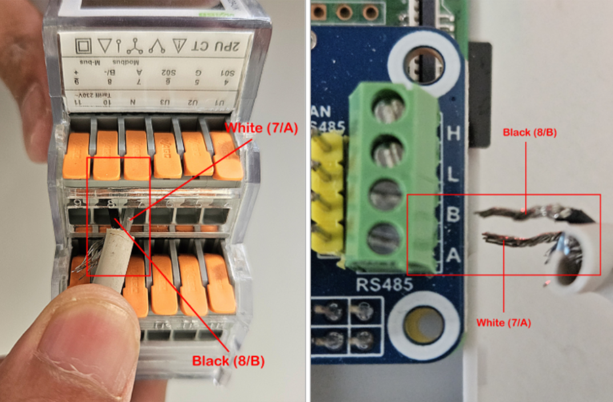
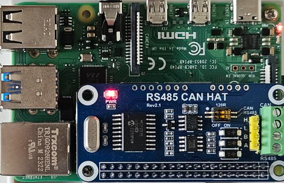
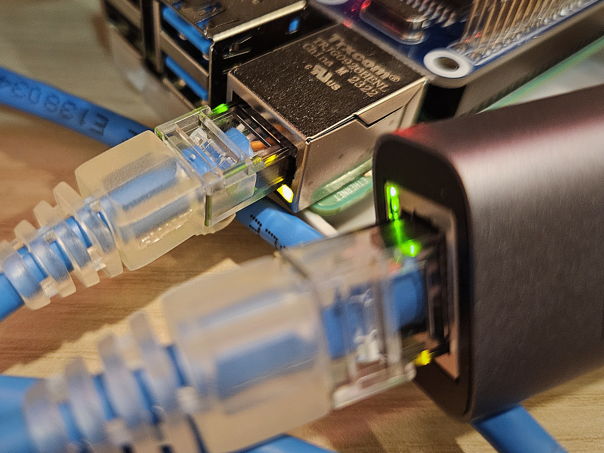
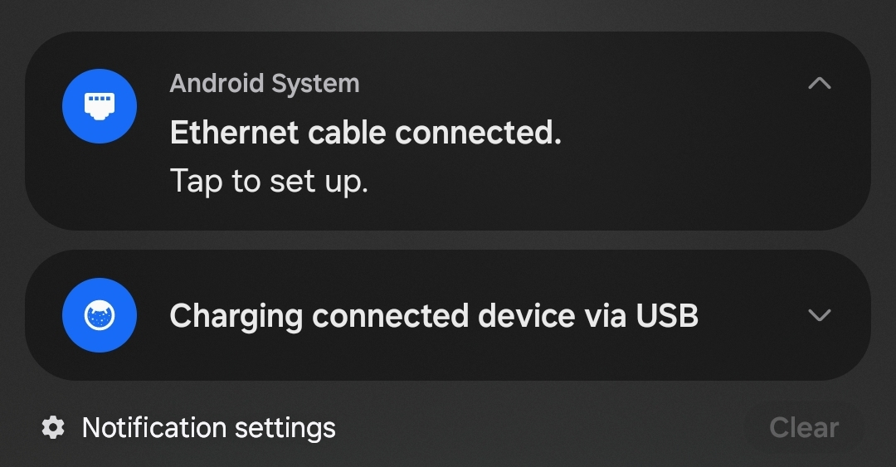
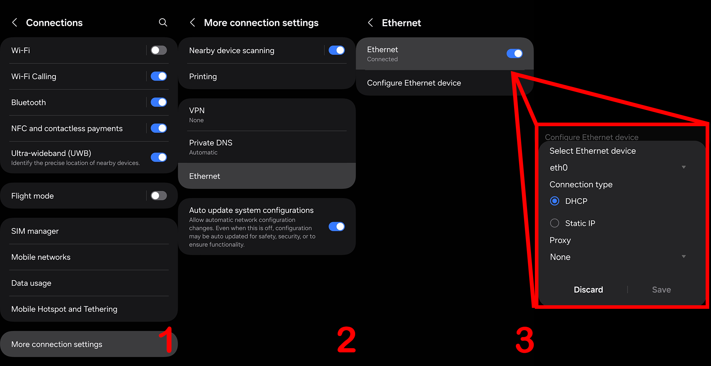
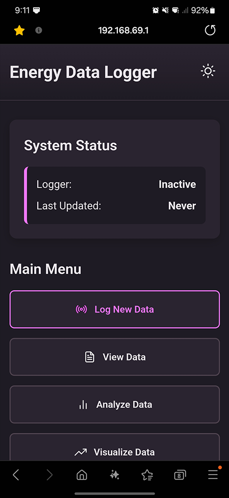
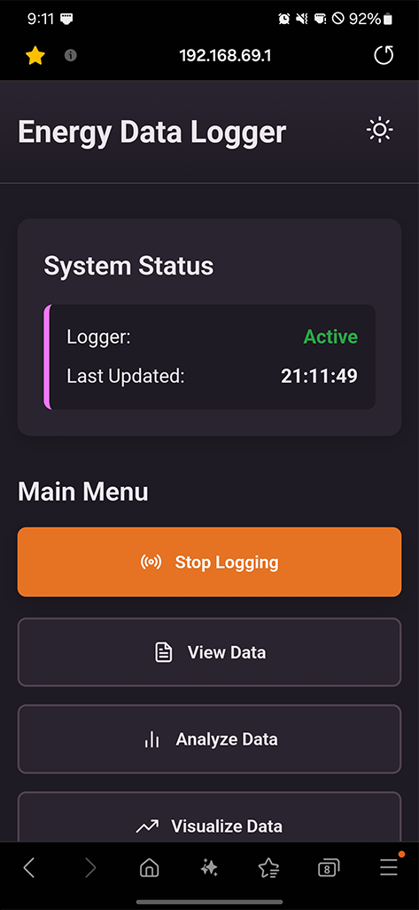

# User Manual: Info & Operating Instructions

## Table of Contents
1. [Getting Started](#section-1-getting-started)
   - [1.1 Component Checklist](#11-component-checklist)
   - [1.2 Physical Hardware Connection](#12-physical-hardware-connection)
2. [Standard Operating Procedures](#section-2-standard-operating-procedures)
   - [2.1 Accessing the Web Dashboard](#21-accessing-the-web-dashboard)
   - [2.2 Initiating a Data Logging Session](#22-initiating-a-data-logging-session-on-site-arrival)
   - [2.3 Concluding a Data Logging Session](#23-concluding-a-data-logging-session-on-site-departure)
3. [Advanced Features](#section-3-advanced-features)
   - [3.1 Viewing and Analyzing Data](#31-viewing-and-analyzing-data)
   - [3.2 Changing Settings](#32-changing-settings)
4. [Troubleshooting](#section-4-troubleshooting)
   - [4.1 Common Issues and Questions](#41-common-issues-and-questions)

---

## Section 1: Getting Started

### 1.1 Component Checklist
The Energy Data Logger kit consists of the following components:

*   **Raspberry Pi 4B (Flashed):** The core of the logger. Ensure the MicroSD card has been flashed with the logger application.
*   **DS3231 RTC Module:** A battery-powered module that continuously provides the Pi synchronized real time.
*   **RS-485 CAN HAT:** A Modbus module that sits on top of the Raspberry Pi.
*   **RS-485 Cable:** Used to connect the CAN HAT’s port A and B for Modbus communication.
*   **AC Power Adapter OR USB-C Adapter:** To power the logger device.
*   **Ethernet Cable (RJ45):** To connect the logger device to the controller device.
*   **Ethernet-to-USB-C Adapter:** To connect the Ethernet cable to a mobile phone (often part of an OTG cable assembly).
*   **Controller Device (BYOD):** A compatible device for accessing the web dashboard.

*Figure 2.1.1. Setup of the Energy Data Logger device.*

*Figure 2.1.2. OTG cable of the Energy Data Logger kit.*

> **Note:** The controller device must support a direct Ethernet connection. This includes Android phones that support "Ethernet" or any laptop computer with an Ethernet (RJ45) port. iPhones and other devices that do not support direct Ethernet are not compatible.

### 1.2 Physical Hardware Connection

#### 1.2.1 Connecting the Logger to the Power Meter
1.  Ensure the energy meter (e.g., WAGO 879-series) is operating and functioning.
2.  Connect the RS-485 cable’s wires from the logger's CAN HAT to the meter’s Modbus terminals as referenced in Figure 2.2.1.1.

*Figure 2.2.1.1. Connecting RS-485 between energy meter and logger device.*

#### 2.2.2 Powering on the Logger
1.  Connect either the AC Power Adapter or a USB-C Adapter to the Raspberry Pi’s power port.
2.  Confirm that the red LED indicator (PWR) on the Raspberry Pi lights up, indicating it has power (Figure 2.2.2.1).

*Figure 2.2.2.1. Light indicator on the Raspberry Pi.*

#### 2.2.3 Connecting the Logger to a Mobile Device
1.  Turn off any other sources of internet on your controller device, such as Wi-Fi and Mobile Data.
2.  Use the OTG cable assembly to connect the Raspberry Pi’s Ethernet port to the mobile phone’s USB-C port.
3.  Ensure that the green/amber LED indicators on both the Raspberry Pi’s and adapter’s Ethernet ports light up, indicating a successful link (Figure 2.2.3.1).
4.  On your mobile device, look for a notification like “Ethernet cable connected” (Figure 2.2.3.2).
5.  If no connection is established, first try restarting the mobile device. If that fails, navigate to your device's network settings and manually enable the Ethernet connection if possible (Figure 2.2.3.3). If no such setting exists, the device may be incompatible.

*Figure 2.2.3.1. LEDs around RJ-45 ports indicate working conditions.*

*Figure 2.2.3.2. Ethernet connection notification after connecting OTG cable.*

*Figure 2.2.3.3. Configuring Ethernet connection settings.*

---

## Section 2: Standard Operating Procedures

### 2.1 Accessing the Web Dashboard
After connecting your controller device to the logger, perform the following steps:

1.  Open any web browser on your controller device (e.g., Chrome, Firefox, Safari).
2.  In the address bar, type `192.168.69.1` and press Enter.
3.  The Energy Data Logger dashboard should now load on your screen.

*Figure 3.1.1. Energy Data Logger webapp interface (OFF).*

### 3.2 Initiating a Data Logging Session (On-site Arrival)
To begin logging energy data at a new site:

1.  Access the web dashboard as described in Section 3.1.
2.  Verify the initial status: the "System Status" panel should show **Logger: Inactive**. This confirms it is ready for a new session.
3.  Press **Settings** and match the logger settings with the onboard meter's Modbus settings.
4.  Press the **“Log New Data”** button.
5.  The logger will begin its session in the background. The web page will update to show **Logger: Active** and the button text will change to **“Stop Logging”**.
6.  You may now safely disconnect your controller device. The logger will continue to run independently.

*Figure 3.2.1. Energy Data Logger webapp interface (ON).*

### 3.3 Concluding a Data Logging Session (On-site Departure)
To conclude the energy data logging session:

1.  Reconnect your controller device and access the web dashboard at `192.168.69.1`.
2.  Verify the logger status is still **“Active”**.
3.  Press the **“Stop Logging”** button. The status will change back to **“Inactive”**.
4.  To retrieve your data, press the **“View Data”** button. A window will appear showing a list of available data files. Each file is named with the date and time it was created. Click on a file to download it.
5.  Once your file is downloaded, you can safely power down and disconnect all devices.

---

## Section 3: Advanced Features

### 3.1 Viewing and Analyzing Data
The web dashboard provides several tools for working with your data:
- **View Data:** Lists all logged CSV files and allows you to download them.
- **Analyze Data:** Select a file to view a full statistical summary (min, max, mean, etc.) for all recorded parameters, as well as viewing the consumption data for every cumulative parameters (e.g. Total Active Energy).
- **Visualize Data:** Select a file to generate plots of the data over time. You can choose from pre-defined categories or create a custom plot by selecting specific parameters.

### 3.2 Changing Settings
The default Modbus settings the logger will poll the meter with are:
- `LOG_INTERVAL`: 900 (15 minutes)
- `MODBUS_SLAVE_ID`: 1
- `BAUDRATE`: 9600
- `PARITY`: N (None)
- `BYTESIZE`: 8
- `STOPBITS`: 1
- `TIMEOUT`: 2

Changing settings in the midst of a logging operation will cause all operations to **stop**. The new settings will only apply in the **next logging session**.

---

## Section 4: Troubleshooting

### 4.1 Common Issues and Questions

**Q: Why is the logger web page loading so slow or not at all?**

*If your controller device has Wi-Fi or Mobile Data enabled, they can interfere with the direct Ethernet connection. Turn them off and then refresh the web page. If it still doesn't load, ensure the logger device is powered on and the Ethernet cable is securely connected at both ends.*

**Q: When I press “Log New Data”, nothing happens. Then it says “Failed to Communicate with the Server”**

*This is typically a Modbus communication issue. Check the following factors:*
1.  *The RS-485 wiring is securely connected and not faulty.*
2.  *The logger's settings (Slave ID, Baud Rate, etc.) in the web UI exactly match the energy meter's configuration.*
3.  *The energy meter itself is powered on and its Modbus communication is active.*

**Q: I disconnected my controller device from the logger after I pressed “Log New Data”. Will it continue to log data?**

*Yes. The Energy Data Logger is designed to run as a standalone service on the Raspberry Pi. Once a session is started, it will continue logging in the background, regardless of whether a controller device is connected. The session only stops when the “Stop Logging” button is pressed.*

**Q: My logger lost power or the RS-485 cable was disconnected during a session. What happens to the data?**

*The logger is designed to be resilient. If the power fails, the application will attempt to resume the previous logging session and append data to the same file upon restart. If the RS-485 cable is disconnected, the logger will repeatedly try to re-establish a connection. If it succeeds, logging will resume. If it fails after multiple retries, the session will terminate to prevent corrupted files.*

**Q: When I press "View Data", "Analyze Data", or "Visualize Data", no files are shown.**

*This means no complete logging sessions have been saved yet. Ensure you have successfully started and stopped at least one session. If you are certain a session was completed, try refreshing the web page, as a hardware lag can sometimes delay the file list from appearing.*

**Q: There are multiple log files. How do I know which one I just created?**

*The log files are named using a `YYYYMMDD_HHMMSS.csv` format, which corresponds to the exact date and time the **“Log New Data”** button was pressed. For example, a session started on June 30th, 2025, at 12:00 PM will be named `20250630_120000.csv`.*

**Q: I set the wrong settings for the meter, would the logger still log?**  

*No, the logger would not start logging and would prompt a “Failed to communicate with the server” error. In order to continue logging, set the correct parameters in the “Settings” option, then refresh once more before starting logging the data.*

**Q: I connected the OTG cable but there is no “Ethernet cable connected” or similar notification.**  

*Sometimes the Ethernet interface on the controller device may hang and not receive the DHCP IP address from the logger device. To establish a successful Ethernet connection, restart the controller device once, and its Ethernet interface should be up. Alternatively, ensure that **Settings > Connections > Ethernet** is enabled.*